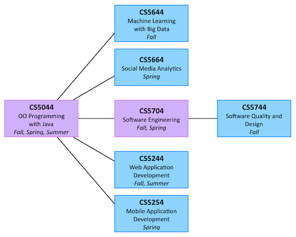

[<i class="far fa-arrow-alt-circle-left"></i> MIT STudents](mit-students.html) | [MENG Info <i class="far fa-arrow-alt-circle-right"></i>](meng-info.html)

# Know Computer Science's Role in the MIT Program

As of Fall 2019, the CS department offers 7 courses in the MIT program. CS5044 (Object-Oriented Programming with Java) is an important course. Not only is it a core course, but it also serves as a gateway course (a prerequisite) to all other CS courses.

We do recommend that students take CS5704 before taking CS5244 or CS5254, but strictly speaking it is not required.

CS5704 is special because it is the only MIT course that is also taught as a face-to-face course for CS major. In general, only MIT students can take the online version of the course and only CS students can take the face-to-face version of the course.
